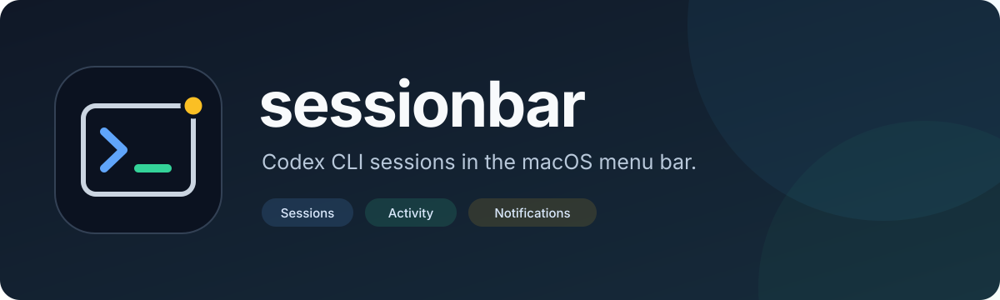
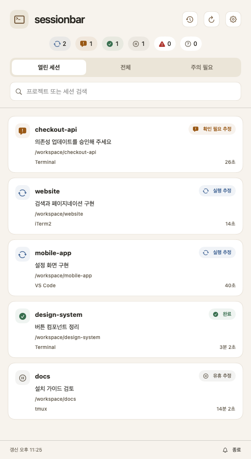
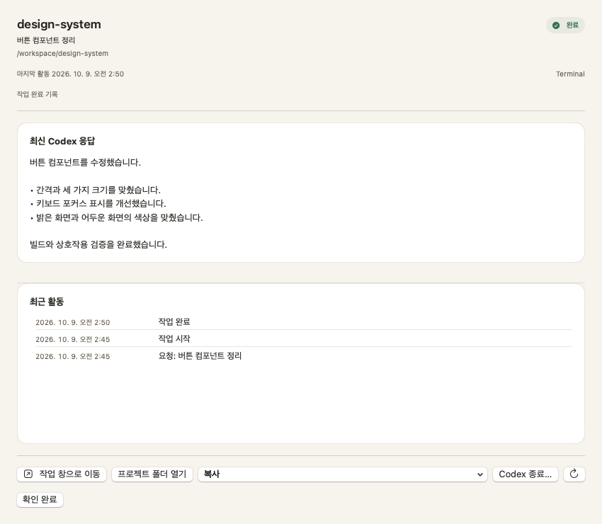
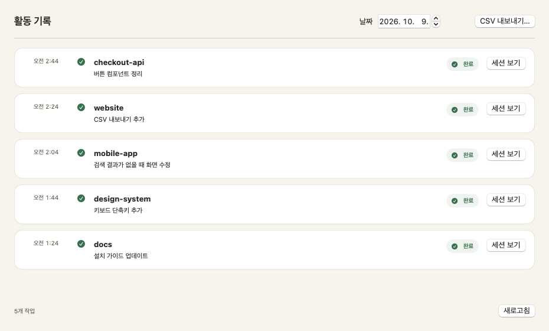
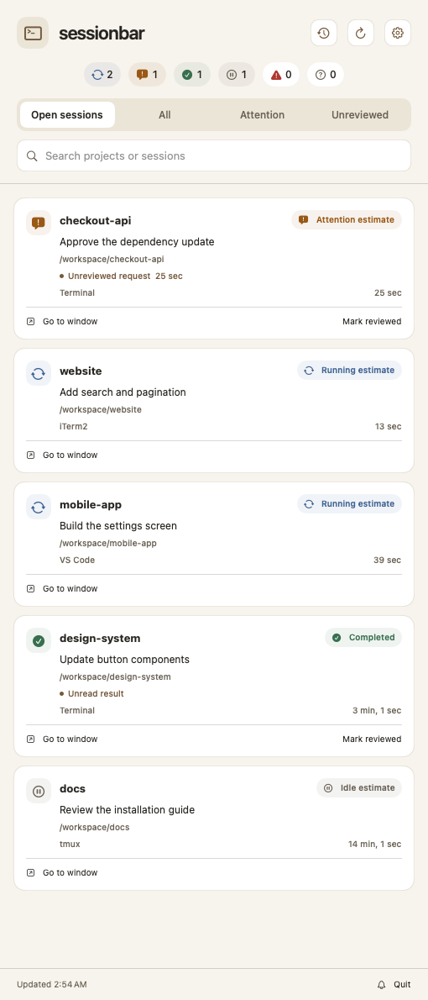
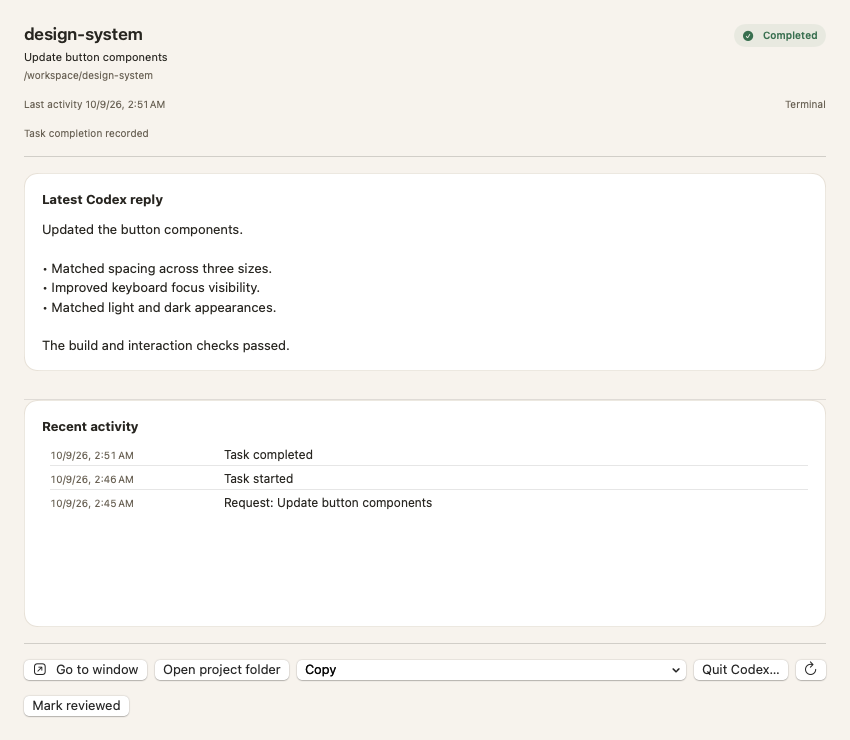
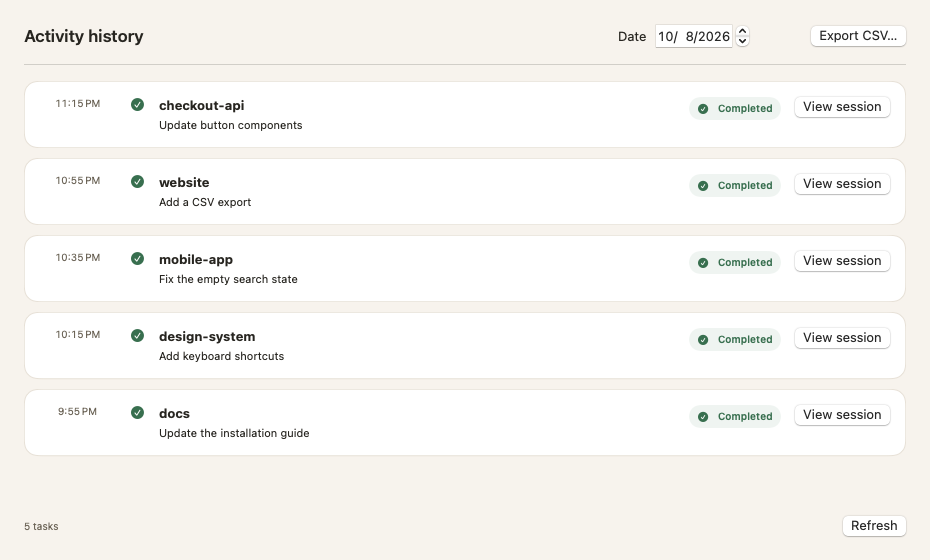

<p align="center">
  
</p>

<p align="center">
  <strong>여러 Codex 세션의 진행 상태와 최근 결과를 한곳에서 확인하세요.</strong><br>
  Keep track of your Codex sessions, attention requests, and recent results.
</p>

<p align="center">
  
  
  
</p>

<p align="center">
  <a href="#한국어">한국어</a> · <a href="#english">English</a> ·
  <a href="https://github.com/sy-shin/sessionbar/archive/refs/heads/main.zip">소스 다운로드 / Download source</a>
</p>

---

<a id="한국어"></a>

## 한국어

**sessionbar**는 macOS 메뉴 막대에서 여러 터미널의 **Codex CLI 세션을 모아 보여주는 앱**입니다. 어느 프로젝트가 작업 중인지, 확인이 필요한 세션이 있는지, 완료된 작업의 결과가 무엇인지 한곳에서 확인할 수 있습니다.

### 이런 작업에 편리합니다

| 작업 상황 | sessionbar에서 할 수 있는 일 |
|:--|:--|
| 여러 프로젝트에서 Codex를 동시에 실행할 때 | 메뉴 막대에서 **실행 중 추정 수와 활성 수**를 보고, 프로젝트별 상태를 목록에서 확인합니다. |
| 승인이나 사용자 입력을 기다리는 세션을 찾을 때 | **주의 필요** 필터로 해당 세션을 모아 보고, 확인 필요 추정 알림을 받을 수 있습니다. |
| 다른 작업을 하다가 Codex 결과를 확인할 때 | 세션을 눌러 **최신 응답과 최근 활동**을 읽습니다. |
| 이전에 끝낸 작업을 다시 확인할 때 | **날짜별 완료·오류 기록**을 찾아보고, 필요한 기간을 CSV로 저장합니다. |
| 작업을 이어갈 프로젝트를 찾을 때 | **프로젝트 폴더를 열거나 세션 ID·재개 명령을 복사**합니다. |

### 1. 여러 세션을 한눈에 확인

프로젝트명, 요청 요약, 상태, 마지막 활동과 터미널 정보를 함께 보여줍니다. 검색으로 프로젝트를 찾거나 **열린 세션 · 전체 · 주의 필요** 중 필요한 목록을 선택하세요.

**주의 필요**에는 현재 열린 세션의 확인 필요 추정과 오류가 표시됩니다. 지난 세션은 **전체**에서 확인할 수 있습니다.

<p align="center">
  
</p>

메뉴 막대에서는 다음처럼 요약합니다.

```text
확인~ 1 · 실행 중~ 2 · 활성 5
```

- **확인~**: 승인이나 입력이 필요한 것으로 추정되는 세션 수입니다.
- **실행 중~**: 응답을 생성하거나 작업을 수행 중인 것으로 추정되는 세션 수입니다.
- **활성**: Codex가 열려 있는 세션 수입니다. 작업을 마친 뒤 다음 입력을 기다리는 세션도 포함합니다.

확인이 필요한 세션이 있으면 메뉴 아이콘이 바뀝니다. 추정 상태는 **실행 추정 · 확인 필요 추정 · 유휴 추정**으로 표시하며, 상세 화면에서 상태 근거와 마지막 활동 시각을 확인할 수 있습니다.

### 2. 최근 결과를 읽고 작업 이어가기

세션을 선택하면 **최신 Codex 응답과 최근 활동**이 열립니다. 창 크기를 조절하면서 결과를 읽고, 프로젝트 폴더를 열거나 재개 명령을 복사할 수 있습니다.

열려 있는 세션은 상세 화면의 **Codex 종료…** 또는 목록의 우클릭 메뉴에서 종료할 수 있습니다. 종료할 세션을 확인하면 해당 Codex가 닫히고, 대화 기록은 남습니다. 다시 작업하려면 재개 명령을 사용하세요.

<p align="center">
  
</p>

### 3. 완료한 작업을 날짜별로 확인

시계 버튼으로 활동 기록을 엽니다. 날짜를 선택해 **완료·오류 작업**을 확인하고, CSV 내보내기에서 기간과 포함할 항목을 선택한 뒤 저장 위치를 정하세요.

<p align="center">
  
</p>

<sub>화면에는 예시 프로젝트와 대화를 사용했습니다.</sub>

### 설치하고 사용하기

**macOS 14 이상 · Swift 6 이상 · Command Line Tools 또는 Xcode**가 필요합니다.

```sh
git clone https://github.com/sy-shin/sessionbar.git
cd sessionbar
./scripts/build-app.sh --install
```

앱은 `~/Applications/sessionbar.app`에 설치됩니다.

1. 앱을 열어 현재 열린 Codex 세션을 확인합니다. 목록 창을 닫아도 메뉴 막대에 남아 있습니다.
2. 메뉴 막대 아이콘을 눌러 목록을 열고, 세션을 선택해 최근 응답을 읽습니다.
3. **톱니바퀴 → 일반 → 언어**에서 시스템·한국어·영어를 선택합니다.
4. 기록 접근이 필요한 세션은 **세션 폴더 연결…**에서 기록이 있는 폴더를 선택합니다. 추가 폴더는 **설정 → 폴더**에서도 연결할 수 있습니다.
5. **설정 → 알림**에서 완료·오류 알림, 알림음과 조용한 시간대를 설정합니다.

### 원하는 방식으로 설정

| 설정 | 기본값 / 선택할 수 있는 항목 |
|:--|:--|
| 화면 | **크림 배경과 흰색 카드** · 시스템 테마 선택 가능 |
| 언어 | **시스템** · 한국어 · English |
| 갱신 | **15초** 간격 · 파일 변경 시에도 갱신 |
| 기록 보관 | 완료·유휴 세션 **30일** · 기간 변경 또는 모두 표시 |
| 알림 | 확인 필요 추정 알림 기본 켜짐 · 완료·오류 알림 개별 선택 |
| 알림 조절 | 알림음 · 조용한 시간대 · 1시간 일시 중지 · 같은 세션의 반복 간격 |
| 앱 실행 | Mac 시작 시 자동 실행 선택 가능 |

<details>
<summary>빌드 옵션과 테스트</summary>

앱 파일만 빌드하려면:

```sh
./scripts/build-app.sh
```

생성 위치는 `build/sessionbar.app`입니다.

테스트:

```sh
./scripts/swift.sh test
```

</details>

---

<a id="english"></a>

## English

**sessionbar** brings **Codex CLI sessions from multiple terminals** into your macOS menu bar. See which projects are working, find sessions that may need your input, and read the results of completed tasks in one place.

### When it helps

| Your workflow | What sessionbar gives you |
|:--|:--|
| Running Codex in several projects at once | Check the **estimated running count and active count** in the menu bar, then see each project's status in the list. |
| Finding sessions waiting for approval or input | Use the **Attention** filter and enable notifications for attention estimates. |
| Checking Codex results while working on something else | Open a session to read its **latest reply and recent activity**. |
| Looking up earlier work | Browse **completed and failed tasks by date**, or export a chosen period to CSV. |
| Returning to a project | **Open its folder or copy the session ID or resume command**. |

### 1. See your sessions together

Each session shows its project, request summary, status, last activity, and available terminal information. Search for a project or choose **Open sessions · All · Attention**.

**Attention** shows attention estimates and errors in currently open sessions. Past sessions remain available in **All**.

<p align="center">
  
</p>

The menu bar summarizes the counts:

```text
Attention~ 1 · Running~ 2 · Active 5
```

- **Attention~**: sessions estimated to need approval or user input.
- **Running~**: sessions estimated to be generating a reply or performing work.
- **Active**: sessions where Codex is still open, including those waiting for the next request after finishing a task.

The menu icon changes when a session may need attention. Estimated states are labeled **Running estimate · Attention estimate · Idle estimate**. Session details show the evidence and the last activity time.

### 2. Read results and continue your work

Select a session to open its **latest Codex reply and recent activity**. Resize the window to read the result, open the project folder, or copy its resume command.

Quit an open session with **Quit Codex…** in its detail window or the list's right-click menu. Confirm the session to close Codex and keep its conversation history. Use the resume command to continue later.

<p align="center">
  
</p>

### 3. Browse completed work by date

Use the clock button to open activity history. Select a date to see **completed and failed tasks**. For a CSV export, choose the date range, included fields, and save location.

<p align="center">
  
</p>

<sub>The screenshots use example projects and conversations.</sub>

### Install and get started

Requires **macOS 14 or later · Swift 6 or later · Command Line Tools or Xcode**.

```sh
git clone https://github.com/sy-shin/sessionbar.git
cd sessionbar
./scripts/build-app.sh --install
```

The app installs to `~/Applications/sessionbar.app`.

1. Open the app to see your current Codex sessions. It stays in the menu bar after you close the list window.
2. Click the menu bar icon to open the list, then select a session to read its recent reply.
3. Choose **System**, **한국어**, or **English** under **Settings → General → Language**.
4. For a session needing record access, use **Connect session folder…** to select its records folder. Connect additional folders under **Settings → Folders**.
5. Set completion and error notifications, sound, and quiet hours under **Settings → Notifications**.

### Make it fit your workflow

| Setting | Default / available options |
|:--|:--|
| Appearance | **Cream background and white cards** · Optional system appearance |
| Language | **System** · 한국어 · English |
| Refresh | Every **15 seconds** · Also refreshes on file changes |
| Retention | Completed and idle sessions kept for **30 days** · Choose a period or keep all |
| Notifications | Attention estimates enabled by default · Optional completion and error notifications |
| Notification controls | Sound · Quiet hours · Pause for 1 hour · Repeat interval per session |
| Launch | Optional automatic startup on your Mac |

<details>
<summary>Build options and tests</summary>

To build the app bundle without installing:

```sh
./scripts/build-app.sh
```

The output is `build/sessionbar.app`.

Tests:

```sh
./scripts/swift.sh test
```

</details>
